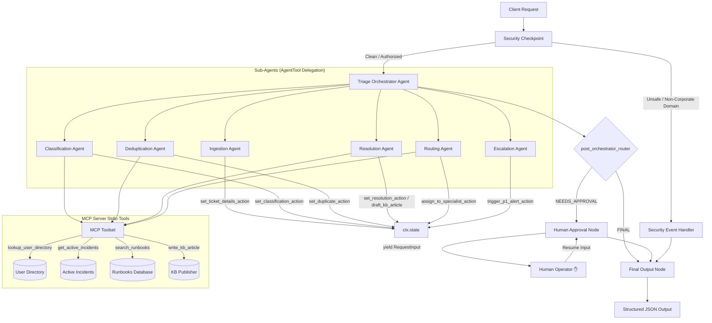

# TicketPilot — Autonomous IT Service Desk Triage & Resolution Agent

TicketPilot is a secure, multi-agent IT service desk assistant built using the Google Agent Development Kit (ADK 2.0). It automates the classification, deduplication, runbook-based auto-resolution, and routing of incoming IT support requests. It features a Human-in-the-Loop approval stage and an integrated Model Context Protocol (MCP) server.

## Assets


***

## Key Features

- **🛡️ Secure Ingestion Pipeline**: Checks for prompt injections, scrubs PII (Credit Cards, SSNs, Passwords), and enforces corporate email domain authorization.
- **🤖 Specialized Multi-Agent Orchestration**: A main orchestrator coordinates six focused sub-agents (Ingestion, Classification, Deduplication, Resolution, Routing, Escalation).
- **🔌 Model Context Protocol (MCP) Integration**: Connects to user directories, ongoing corporate outages, runbooks, and KB publication tools over standard stdio transport.
- **✋ Human-in-the-Loop Checkpoints**: Automatically pauses and requests operator confirmation before modifying settings or resolving high-priority tickets.
- **⏱️ API Quota Protection (Rate-Limiting)**: Custom `RateLimitedGemini` implementation that injects a 5-second delay to smooth traffic spikes and avoid Google API `429 ResourceExhausted` rate limits.

***

## System Architecture

TicketPilot organizes its workflows using a deterministic directed acyclic graph (DAG) implemented in the ADK workflow runner:



***

## Directory Structure

```
ticket-pilot/
├── app/
│   ├── agent.py                 # Main workflow graph & agent nodes
│   ├── config.py                # Configuration parsing & environment variables
│   ├── mcp_server.py            # Model Context Protocol stdio tools
│   ├── agent_runtime_app.py     # FastAPI server entry point
│   └── app_utils/
│       ├── telemetry.py         # OpenTelemetry instrumentation
│       └── typing.py            # Shared data types
├── assets/                      # Professional images for documentation
│   ├── architecture_diagram.png # 16:9 Agent graph flow diagram
│   └── cover_page_banner.png    # 16:9 Premium banner
├── tests/                       # Unit & integration testing suites
│   ├── unit/
│   └── integration/
├── Makefile                     # Build & run automation
├── pyproject.toml               # Python project configuration & dependencies
└── DEMO_SCRIPT.txt              # Timed demo presentation guide
```

***

## Prerequisites

- **Python 3.11–3.13** (Verify with `python --version`)
- **uv** (Astral's fast Python package manager)
- **Gemini API Key** from [Google AI Studio](https://aistudio.google.com/apikey)

***

## Getting Started

### 1. Project Installation
Clone the repository, navigate into the directory, and install dependencies using `uv`:
```bash
git clone https://github.com/gururajpanse/TicketPilot.git
cd ticket-pilot
make install
```

### 2. Configure Environment Variables
Copy `.env.example` to `.env` and configure your API key:
```bash
GOOGLE_API_KEY=your_gemini_api_key_here
GOOGLE_GENAI_USE_VERTEXAI=False
GEMINI_MODEL=gemini-3.1-flash-lite
MOCK_MODE=False
```
> [!TIP]
> **What is MOCK_MODE?**
> Setting `MOCK_MODE=True` redirects all LLM sub-agent queries to local Python mock functions, reducing LLM calls to **0** and bypassing API key quota lockouts completely while retaining the full Dev UI experience.

### 3. Run the Playground UI
Start the interactive developer interface:
```bash
make playground
```
*The Playground UI will open at **[http://localhost:18081](http://localhost:18081)**.*

### 4. Run the API Server
Start the agent as a local FastAPI web service:
```bash
make run
```

***

## Testing Scenarios

Use the following input payloads in the Playground UI to verify the different execution paths:

### 1. Automated Runbook Resolution (Access/Lockout)
*   **Payload (JSON)**:
    ```json
    {
      "title": "Help! Account locked out after multiple attempts",
      "description": "I cannot login to my account. My password was wrong. Please reset it.",
      "user": "alice@company.com",
      "priority": "Medium"
    }
    ```
*   **Expected Behavior**: Security filter passes. Category mapped to `access`/`P3`. Matches runbook `RB-002` (Password Reset). Automatically resets password, drafts KB article, and closes as `AUTO_RESOLVED`.

### 2. Storm Incident Deduplication (AWS Network Outage)
*   **Payload (JSON)**:
    ```json
    {
      "title": "VPN is down",
      "description": "I cannot connect to the corporate VPN from US East. Getting connection failed errors.",
      "user": "bob@company.com",
      "priority": "High"
    }
    ```
*   **Expected Behavior**: Identified as a duplicate of ongoing global outage `INC-8801` (AWS US-East Network Outage) via `get_active_incidents()`. Marked as `DEDUPLICATED` and linked to the parent incident.

### 3. Human-in-the-Loop Approval (VPN Profile Corruption)
*   **Payload (JSON)**:
    ```json
    {
      "title": "VPN profile settings corrupt",
      "description": "My VPN configuration profile appears to be corrupt, need a new profile config file.",
      "user": "alice@company.com",
      "priority": "High"
    }
    ```
*   **Expected Behavior**: Classified as `network`/`P2`. Unique case (does not deduplicate to global outage). Since the user profile needs manual configuration adjustment, status shifts to `NEEDS_HUMAN_APPROVAL` and halts execution.
*   **Action**: In the Dev UI, type **`YES`** in the response box to approve the profile reissuance. The ticket will close successfully as `AUTO_RESOLVED`.

***

## Troubleshooting

1.  **429 Resource Exhausted (Rate Limits)**
    *   *Cause*: Gemini free tier keys have requests-per-minute (RPM) and requests-per-day (RPD) limits.
    *   *Fix*: Set `GEMINI_MODEL=gemini-3.1-flash-lite` in `.env` to leverage higher limits. Our custom `RateLimitedGemini` model class dynamically spaces LLM requests with 5-second intervals.
2.  **Windows Port Listener Conflict**
    *   *Cause*: PowerShell Uvicorn file watcher conflicts on reload.
    *   *Fix*: Run the following to force close listeners and restart the playground:
        ```powershell
        Get-Process -Id (Get-NetTCPConnection -LocalPort 18081, 8090 -ErrorAction SilentlyContinue).OwningProcess | Stop-Process -Force
        make playground
        ```

***

## Push to GitHub

1.  Create a new repository at https://github.com/new
2.  Follow the instructions in the project root:
    ```bash
    git init
    git add .
    git commit -m "Initial commit: ticket-pilot ADK agent"
    git branch -M main
    git remote add origin https://github.com/<your-username>/ticket-pilot.git
    git push -u origin main
    ```

***

## Demo Script

A complete timed presentation walkthrough is available in [**`DEMO_SCRIPT.txt`**](DEMO_SCRIPT.txt).
