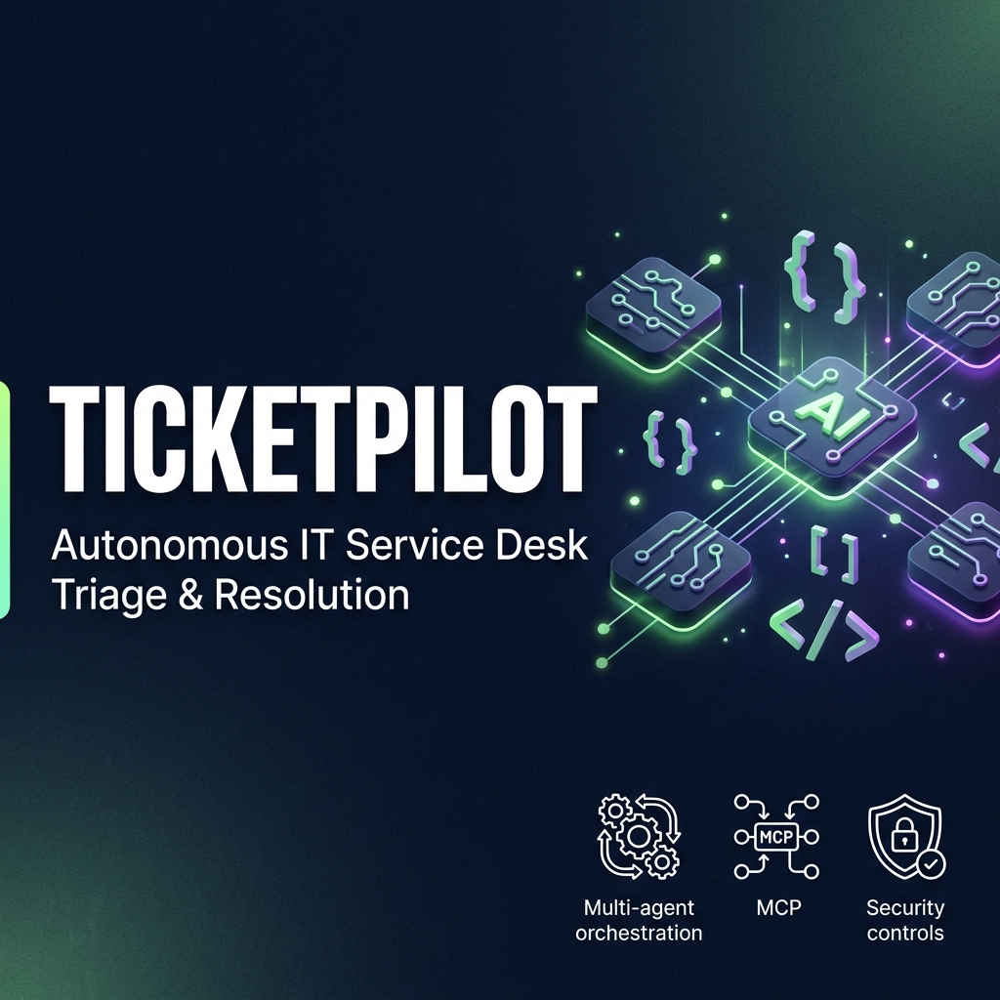
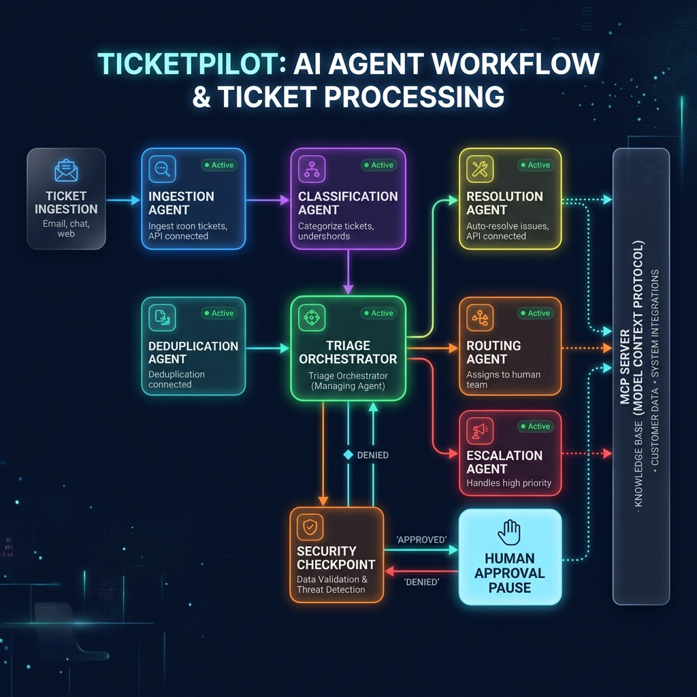
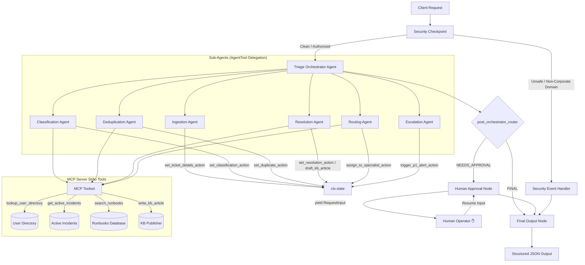

# TicketPilot — Autonomous IT Service Desk Triage & Resolution Agent

TicketPilot is an advanced, secure multi-agent IT service desk assistant built using the Google Agent Development Kit (ADK 2.0). It automates the classification, deduplication, runbook-based auto-resolution, and routing of incoming IT support requests, featuring a Human-in-the-Loop approval stage and an integrated Model Context Protocol (MCP) server.

## Assets





***

## Prerequisites

- **Python 3.11–3.13** (Verify with `python --version`)
- **uv** (Astral's fast Python package manager)
- **Gemini API Key** from [Google AI Studio](https://aistudio.google.com/apikey)

## Quick Start

1. Clone this repository:
   ```bash
   git clone <repo-url>
   cd ticket-pilot
   ```

2. Copy the environment configuration template and insert your `GOOGLE_API_KEY`:
   ```bash
   cp .env.example .env
   ```
   *(Ensure `.env` contains: `GOOGLE_API_KEY=your_key_here`, `GOOGLE_GENAI_USE_VERTEXAI=False`, and `GEMINI_MODEL=gemini-2.5-flash-lite`)*

3. Install the dependencies:
   ```bash
   make install
   ```

4. Launch the interactive Playground UI:
   - **macOS/Linux**:
     ```bash
     make playground
     ```
   - **Windows (PowerShell)**:
     ```powershell
     uv run adk web app --host 127.0.0.1 --port 18081 --reload_agents
     ```
   *The Playground UI will open at [http://localhost:18081](http://localhost:18081)*

***

## Architecture Diagram

The diagram below represents the security filters, orchestration nodes, sub-agents, and tools within TicketPilot:



***

## How to Run

- **Playground Mode**: Run `make playground` (or the direct `adk web` command on Windows) to start the local developer dashboard.
- **Service Web Server Mode**: Run `make run` to run the agent in FastAPI-backed event-driven API mode.
- **Run Unit Tests**: Run `make test` to execute testing suites.

***

## Sample Test Cases

Test the following scenarios inside the local Playground UI:

### Test Case 1: Auto-Resolution (Access / Password Lockout)
- **Input**:
  ```json
  {
    "title": "Help! Account locked out after multiple attempts",
    "description": "I cannot login to my account. My password was wrong. Please reset it.",
    "user": "alice@company.com",
    "priority": "Medium"
  }
  ```
- **Expected Path**: `security_checkpoint` passes successfully. `triage_orchestrator` classifies the ticket as `access`/`P3`. `deduplication_agent` finds no duplicate incident storms. `resolution_agent` searches the MCP runbooks, matches the **Password Reset** runbook (`RB-002`), applies the steps, drafts a KB article, and closes the ticket.
- **Check**: The UI should show the ticket status as `AUTO_RESOLVED`, `resolution_notes` listing reset steps, and `kb_article_drafted: true`.

### Test Case 2: Outage Deduplication (Network / Outage Duplicate)
- **Input**:
  ```json
  {
    "title": "VPN is down",
    "description": "I cannot connect to the corporate VPN from US East. Getting connection failed errors.",
    "user": "bob@company.com",
    "priority": "High"
  }
  ```
- **Expected Path**: `security_checkpoint` passes. `triage_orchestrator` classifies it as `network`/`P2`. `deduplication_agent` queries the MCP tool `get_active_incidents()`, matches the description with active outage `INC-8801` (AWS US-East-1 Network Outage), calls `set_duplicate_action`, and clusters it.
- **Check**: The UI should output `deduplicated: true` and `parent_incident_id: "INC-8801"`.

### Test Case 3: Human-in-the-Loop Approval (VPN Profile Corruption)
- **Input**:
  ```json
  {
    "title": "VPN profile settings corrupt",
    "description": "My VPN configuration profile appears to be corrupt, need a new profile config file.",
    "user": "alice@company.com",
    "priority": "High"
  }
  ```
- **Expected Path**: Classifies as `network`/`P2`. `deduplication_agent` checks and finds no outage duplicate. `resolution_agent` matches the **VPN Connection Reset** runbook (`RB-001`), but because the ticket has a `High` priority and involves config adjustments, it triggers the `NEEDS_HUMAN_APPROVAL` status. The workflow pauses at `human_approval_node` and yields a `RequestInput` event.
- **Check**: The dashboard UI will display a prompt asking you to approve the resolution. Reply with **`YES`** to resume the workflow. The ticket closes with `AUTO_RESOLVED` status and the `human_approved: true` state flag saved in the audit logs.

***

## Troubleshooting

1. **429 Resource Exhausted (Quota Limits)**:
   - *Cause*: The standard free tier key is heavily throttled for `gemini-2.5-flash` requests (20 requests per day limit).
   - *Fix*: Ensure you are using `GEMINI_MODEL=gemini-2.5-flash-lite` in your `.env` file, which has higher daily allowances. Otherwise, swap the `GOOGLE_API_KEY` in `.env` with a key from a fresh Google account.

2. **Windows Server Not Picking Up Code Edits**:
   - *Cause*: The file-watcher conflicts with subprocess-spawning in Windows PowerShell.
   - *Fix*: Stop the port listeners manually and restart the server whenever you edit files. Run in PowerShell:
     ```powershell
     Get-Process -Id (Get-NetTCPConnection -LocalPort 18081, 8090 -ErrorAction SilentlyContinue).OwningProcess | Stop-Process -Force
     make playground
     ```

3. **No Agents Found / Directory Error**:
   - *Cause*: Hardcoded `app` dir in `adk web` when the folder is named differently.
   - *Fix*: Our scaffolded directory name is explicitly `app`. Ensure the launch command is run as `uv run adk web app ...` from the project folder root.

***

## Push to GitHub

1. Create a new repo at https://github.com/new
   - Name: ticket-pilot
   - Visibility: Public or Private
   - Do NOT initialize with README (you already have one)

2. In your terminal, navigate into your project folder:
   ```bash
   cd ticket-pilot
   git init
   git add .
   git commit -m "Initial commit: ticket-pilot ADK agent"
   git branch -M main
   git remote add origin https://github.com/<your-username>/ticket-pilot.git
   git push -u origin main
   ```

3. Verify .gitignore includes:
   ```
   .env          ← your API key — must NEVER be pushed
   .venv/
   __pycache__/
   *.pyc
   .adk/
   ```

⚠ NEVER push `.env` to GitHub. Your API key will be exposed publicly.

***

## Demo Script

The timed, spoken presentation narration script is available in [DEMO_SCRIPT.txt](DEMO_SCRIPT.txt).
