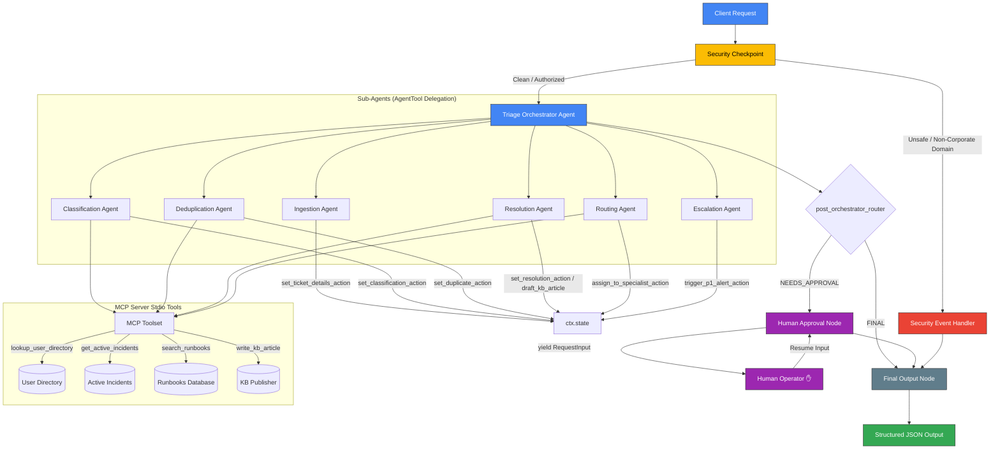

# 🎫 TicketPilot — Autonomous IT Service Desk Triage & Resolution Agent

> An autonomous, secure IT service desk triage and resolution agent built with **Google ADK 2.0** and Gemini that automatically ingests, classifies, deduplicates, and resolves incoming support requests through a graph-based workflow — combining LLM intelligence, security guardrails, custom MCP tools, and human-in-the-loop oversight.

[](https://www.python.org/downloads/)
[](https://adk.dev/)
[](LICENSE)

---

## 🎨 Assets


---

## 🏗️ Architecture

TicketPilot organizes its workflows using a deterministic directed acyclic graph (DAG) implemented in the ADK workflow runner:



---

## 💻 Tech Stack

- **Core Runtime:** Python 3.11 - 3.13
- **Package Management:** uv (Fast Python package manager)
- **Agent Framework:** Google Agent Development Kit (ADK) 2.0 Workflow API
- **Models:** Gemini 2.5-flash / Gemini-3.1-flash-lite
- **MCP Server Framework:** FastMCP stdio server
- **Command Runner:** Make/Makefile (supporting clean targets)

---

## 📂 Folder Structure

```
ticket-pilot/
├── app/
│   ├── agent.py                 # ADK Workflow graph & sub-agents definition
│   ├── config.py                # Universal configuration and model settings
│   ├── mcp_server.py            # FastMCP stdio server exposing database tools
│   ├── agent_runtime_app.py     # FastAPI server entry point
│   └── app_utils/
│       ├── telemetry.py         # OpenTelemetry instrumentation
│       └── typing.py            # Shared data types
├── assets/                      # Image assets (banners, graphs)
│   ├── architecture_diagram.png # 16:9 Agent graph flow diagram
│   └── cover_page_banner.png    # 16:9 Premium banner
├── tests/                       # Integration & unit test files
├── .env.example                 # Environment variables template
├── Makefile                     # Automated installation and launch targets
├── pyproject.toml               # uv dependency configuration
└── README.md                    # User manual
```

---

## ⚙️ Installation

Clone the repository and install the dependencies:
```bash
git clone https://github.com/gururajpanse/TicketPilot.git
cd ticket-pilot
make install
```

---

## 🔒 Configuration (.env)

Setup your environment configurations:

1. Copy the template:
   ```bash
   cp .env.example .env
   ```
2. Open `.env` and add your Gemini API Key:
   ```env
   GOOGLE_API_KEY=your_gemini_api_key_here
   GOOGLE_GENAI_USE_VERTEXAI=False
   GEMINI_MODEL=gemini-3.1-flash-lite
   MOCK_MODE=False
   ```
   *(Ensure `MOCK_MODE=True` is enabled if you have exhausted your API key daily free-tier quota, which runs all sub-agents locally in python).*

---

## 🚀 Running the Project

Launch the Dev Playground UI:
```bash
make playground
```
*(Opens the ADK testing web application at http://localhost:18081)*

Start local API Server mode:
```bash
make run
```

Run unit and integration tests:
```bash
make test
```

---

## 💡 Usage

### Running an Analysis
1. Open the Dev Playground UI at http://localhost:18081.
2. Click **New Session** at the top.
3. Paste a ticket query in JSON or raw text. Example:
   ```json
   {
     "title": "VPN profile settings corrupt",
     "description": "My VPN configuration profile appears to be corrupt, need a new profile config file.",
     "user": "alice@company.com",
     "priority": "High"
   }
   ```
4. If the request requires human review, the agent will pause. Simply type `YES` in the response box to proceed.

### Test Case Scenarios
- **Auto-Resolution:** Input an account lockout query. It matches standard password reset runbooks (`RB-002`), auto-resolves, and publishes a KB article.
- **Storm Incident Deduplication:** Input a general VPN outage report. It queries active outages, identifies the AWS incident (`INC-8801`), and maps the ticket to it.
- **Human-in-the-Loop Review:** Input a High priority VPN configuration adjustments query. It triggers a human approval prompt.

---

## 📊 Example Output

When a ticket is successfully resolved and approved by the human operator, TicketPilot compiles a structured state output:

```json
{
  "ticket_id": "TICK-2900",
  "title": "VPN profile settings corrupt",
  "status": "AUTO_RESOLVED",
  "category": "network",
  "severity": "P2",
  "deduplicated": false,
  "parent_incident_id": "",
  "resolution_notes": "The user has a corrupt VPN profile. Following standard procedure RB-001: 1. Reset VPN profile in settings. 2. Clear local browser DNS cache. 3. Re-verify MFA token. 4. Restart connection. Since this involves manual config profile adjustments, it requires human approval per protocol.",
  "kb_article_drafted": false,
  "kb_article_content": "",
  "audit_log": [
    {
      "timestamp": "2026-07-05 01:29:00.800259",
      "event": "INITIAL_TRIAGE",
      "severity": "INFO",
      "message": "Triage started for ticket TICK-2900 submitted by alice@company.com"
    },
    {
      "timestamp": "2026-07-05 01:31:06.095256",
      "event": "HUMAN_APPROVAL",
      "severity": "INFO",
      "message": "Human approved resolution. Feedback: yes"
    },
    {
      "timestamp": "2026-07-05 01:31:06.113535",
      "event": "TICKET_CLOSED",
      "severity": "INFO",
      "message": "Ticket TICK-2900 processing ended with status: AUTO_RESOLVED"
    }
  ]
}
```

---

## 🛡️ Security Features

- **PII Scrubbing:** Automatically redacts credit cards, emails, and passwords from incoming description inputs.
- **Prompt Injection Block:** Rejects prompt injection keywords like `ignore guidelines` or `system instruction override` instantly.
- **Domain Verification:** Enforces email domain verification (blocking anything outside `@company.com`, `@corp.com`, or `@internal.net`).

---

## 🔮 Future Improvements

- **Active Directory Sync:** Dynamic user listings synchronization.
- **Cloud Ticket Provider Integration:** Scanners for JIRA and ServiceNow ticketing platforms.
- **Automated Alerts:** Emails on P1 critical alert pager triggers.

---

## 🤝 Contributing

1. Fork the Project.
2. Create your Feature Branch (`git checkout -b feature/AmazingFeature`).
3. Commit your Changes (`git commit -m 'Add some AmazingFeature'`).
4. Push to the Branch (`git push origin feature/AmazingFeature`).
5. Open a Pull Request.

---

## ✍️ Authors

- **Gururaj Panse** (GitHub: [@gururajpanse](https://github.com/gururajpanse))

---

## 🎙️ Demo Presentation

A complete timed presentation script is available in [**`DEMO_SCRIPT.txt`**](DEMO_SCRIPT.txt).
