# 🎫 TicketPilot — Autonomous IT Service Desk Triage & Resolution Agent

> An autonomous, secure IT service desk triage and resolution agent built with **Google ADK 2.0** and Gemini that automatically ingests, classifies, deduplicates, and resolves incoming support requests through a graph-based workflow — combining LLM intelligence, security guardrails, custom MCP tools, and human-in-the-loop oversight.

[](https://www.python.org/downloads/)
[](https://adk.dev/)
[](LICENSE)

---

## 🎨 Assets


---

## ✨ Features

- **🛡️ Secure Ingestion** — Checks inputs for prompt injections, scrubs PII (Credit Cards, SSNs, Passwords), and enforces corporate email domain authorization.
- **🔄 Graph-Based Control Flow** — Orchestrates support requests using a directed graph with custom routing nodes implemented via the ADK workflow.
- **🤖 Multi-Agent Delegation** — Leverages a main triage orchestrator delegating dynamically to 6 sub-agents (Ingestion, Classification, Deduplication, Resolution, Routing, Escalation).
- **🔌 Model Context Protocol (MCP)** — Integrated MCP server running on local stdio transport to query user directory profiles, active incident storms, and search runbooks.
- **👤 Human-in-the-Loop (HITL)** — High-priority requests and manual configuration adjustments automatically pause for manager approval.
- **⏱️ API Quota Protection (Rate-Limiting)** — Custom `RateLimitedGemini` decorator subclassing that delays requests to prevent free-tier 429 quota exhaustion.

---

## 🏗️ Architecture

```mermaid
graph TD
    START[Client Request] --> SEC[Security Checkpoint]
    SEC -->|Unsafe / Non-Corporate Domain| SEC_EV[Security Event Handler]
    SEC -->|Clean / Authorized| ORCH[Triage Orchestrator Agent]
    
    subgraph "Sub-Agents (AgentTool Delegation)"
        ORCH --> ING[Ingestion Agent]
        ORCH --> CLS[Classification Agent]
        ORCH --> ESC[Escalation Agent]
        ORCH --> DED[Deduplication Agent]
        ORCH --> RES[Resolution Agent]
        ORCH --> RTE[Routing Agent]
    end
    
    subgraph "MCP Server Stdio Tools"
        CLS & DED & RES & RTE --> MCP[MCP Toolset]
        MCP -->|lookup_user_directory| DIR[(User Directory)]
        MCP -->|get_active_incidents| INC[(Active Incidents)]
        MCP -->|search_runbooks| RUN[(Runbooks Database)]
        MCP -->|write_kb_article| WRI[(KB Publisher)]
    end

    ING -->|set_ticket_details_action| ST[ctx.state]
    CLS -->|set_classification_action| ST
    DED -->|set_duplicate_action| ST
    RES -->|set_resolution_action / draft_kb_article| ST
    RTE -->|assign_to_specialist_action| ST
    ESC -->|trigger_p1_alert_action| ST

    ORCH --> ROUTE{post_orchestrator_router}
    ROUTE -->|NEEDS_APPROVAL| HITL[Human Approval Node]
    ROUTE -->|FINAL| OUT[Final Output Node]
    
    HITL -->|yield RequestInput| USER[Human Operator ✋]
    USER -->|Resume Input| HITL
    HITL --> OUT
    SEC_EV --> OUT
    OUT --> END[Structured JSON Output]

    style START fill:#4285F4,stroke:#333,color:#fff
    style SEC fill:#FBBC04,stroke:#333,color:#000
    style SEC_EV fill:#EA4335,stroke:#333,color:#fff
    style ORCH fill:#4285F4,stroke:#333,color:#fff
    style HITL fill:#9C27B0,stroke:#333,color:#fff
    style USER fill:#9C27B0,stroke:#333,color:#fff
    style OUT fill:#607D8B,stroke:#333,color:#fff
    style END fill:#34A853,stroke:#333,color:#fff
```



---

## 📁 Project Structure

```
ticket-pilot/
├── app/
│   ├── agent.py                 # Main workflow graph & agent nodes
│   ├── config.py                # Configuration parsing & environment variables
│   ├── mcp_server.py            # Model Context Protocol stdio tools
│   ├── agent_runtime_app.py     # FastAPI server entry point
│   └── app_utils/
│       ├── telemetry.py         # OpenTelemetry instrumentation
│       └── typing.py            # Shared data types
├── assets/                      # Professional images for documentation
│   ├── architecture_diagram.png # 16:9 Agent graph flow diagram
│   └── cover_page_banner.png    # 16:9 Premium banner
├── tests/                       # Unit & integration testing suites
│   ├── unit/
│   └── integration/
├── Makefile                     # Build & run automation
├── pyproject.toml               # Dependencies & tooling configuration
└── DEMO_SCRIPT.txt              # Timed demo presentation guide
```

---

## 🚀 Quick Start

### Prerequisites

- **Python 3.11–3.13**
- **uv** — [Install](https://docs.astral.sh/uv/getting-started/installation/)
- **Gemini API Key** — Get one from [Google AI Studio](https://aistudio.google.com/)

### Setup

```bash
# 1. Clone the repository
git clone https://github.com/gururajpanse/TicketPilot.git
cd ticket-pilot

# 2. Configure your environment file
cp .env.example .env
# Edit .env and insert your GOOGLE_API_KEY

# 3. Install dependencies
make install

# 4. Launch the interactive playground UI
make playground
```

*The playground opens a web UI at **[http://localhost:18081](http://localhost:18081)**.*

---

## 📝 Example Payloads

### 1. Auto-Resolution (Access / Password Reset)

```json
{
  "title": "Help! Account locked out after multiple attempts",
  "description": "I cannot login to my account. My password was wrong. Please reset it.",
  "user": "alice@company.com",
  "priority": "Medium"
}
```
* **Expected Output**: Classified as `access`/`P3`. Matches runbook `RB-002` (Password Reset), resets password, publishes KB article, and closes as `AUTO_RESOLVED`.

### 2. Outage Deduplication (Network Outage Duplicate)

```json
{
  "title": "VPN is down",
  "description": "I cannot connect to the corporate VPN from US East. Getting connection failed errors.",
  "user": "bob@company.com",
  "priority": "High"
}
```
* **Expected Output**: Classified as `network`/`P2`. Maps to active regional outage `INC-8801` (AWS US-East Network Outage), marked as `DEDUPLICATED` and linked to it.

### 3. Human-in-the-Loop Approval (VPN Profile Corruption)

```json
{
  "title": "VPN profile settings corrupt",
  "description": "My VPN configuration profile appears to be corrupt, need a new profile config file.",
  "user": "alice@company.com",
  "priority": "High"
}
```
* **Expected Output**: Classified as `network`/`P2`. Standalone local error. Pauses at `human_approval_node` requiring manager confirmation. Type `YES` to resume and close as `AUTO_RESOLVED`.

---

## 🛠️ Troubleshooting

1. **429 Resource Exhausted (Rate Limits)**
   - *Cause*: Google AI Studio free tier keys have daily request ceilings.
   - *Fix*: Set `GEMINI_MODEL=gemini-3.1-flash-lite` in your `.env` file to leverage higher quotas. Our custom `RateLimitedGemini` decorator dynamically spaces request triggers with 5-second sleep intervals.
   - *Mock Mode*: Set `MOCK_MODE=True` in `.env` to bypass API calls completely and run all sub-agents locally in python.

2. **Windows Port Listener Conflict**
   - *Cause*: PowerShell reload conflicts with background uvicorn handles.
   - *Fix*: Kill active handles manually and restart uvicorn:
     ```powershell
     Get-Process -Id (Get-NetTCPConnection -LocalPort 18081, 8090 -ErrorAction SilentlyContinue).OwningProcess | Stop-Process -Force
     make playground
     ```

---

## 🎙️ Demo Presentation

A timed spoken walkthrough is available in [**`DEMO_SCRIPT.txt`**](DEMO_SCRIPT.txt) to guide you through presenting the application.
